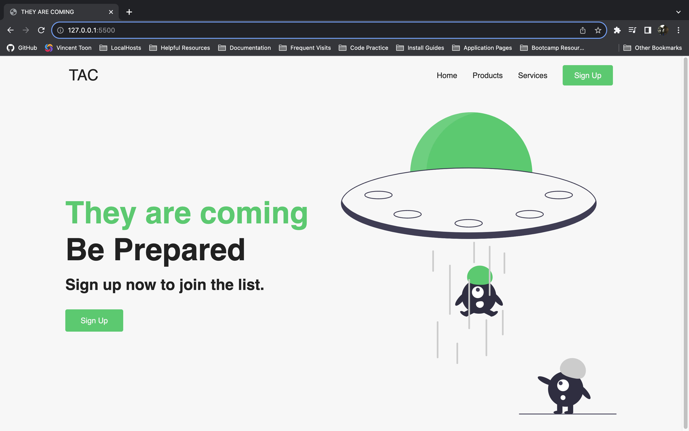
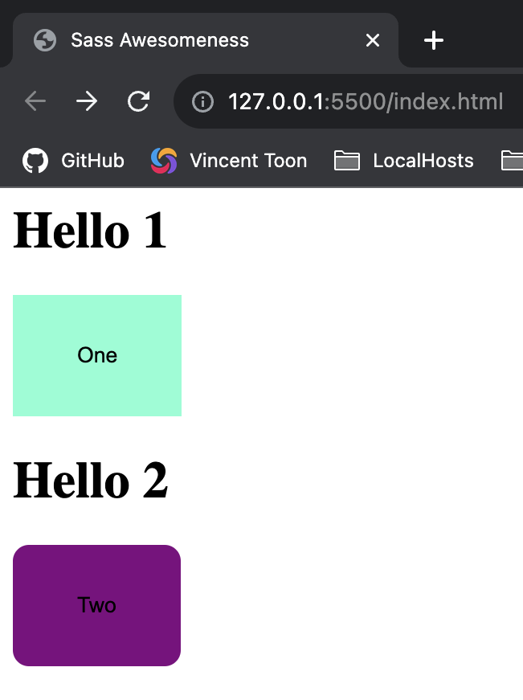

# Learn SaSS

## Description

Full Stack Project for refreshing my brain on the intricacies of frameworks from Bootcamp (it's been a long year), combined with new technologies, encompassed by an encounter of a new kind (aliens). Tom Delonge would be proud. (MERN, JS, SQL, and SaSS are the ideas.)

By: [Vincent Toon](https://github.com/Vincenttoon)

## Table of Contents

* [Future Improvements](#future-improvements)

* [Example 2](#example-2)

* [Example 1](#example-1)

* [SaSS Notes](#sass-notes)

* [Tests](#tests)

* [Usage](#usage)  

* [Bugs](#bugs)

* [Questions?](#questions)

## Future Improvements

* Create Back End 
 - User (login/logout (friends/list?))
    - Posts w/ comments

* Front End
    - Articles (home)
    - Products (static list)
        - New Payment Page?
    - Log-in Log-Out
    - Planets?
    - Google Earth?


## Example 2: 

* 
### Youtube Source

- [Brian Design](youtube.com/@briandesign)
- [They Are Coming Video](https://www.youtube.com/watch?v=pk-MEjUINjI)

(SaSS notes learned throughout the video)

## Example 1:

* 
  ### Youtube Source

- [Yash Patel](https://www.youtube.com/@yashpatel1O1)
- [Learn Sass in 1234 Seconds](https://www.youtube.com/watch?v=7wfAXtJcjho&t=3s)

(SaSS notes learned throughout the video)

### SaSS Notes

Sass is a powerful CSS preprocessor that extends the capabilities of traditional CSS. It simplifies and enhances the way you write and manage stylesheets for web development.

#### Key Features

- **Variables:** Define reusable values, such as colors and font sizes, to maintain consistency and make changes easier.

- **Nesting:** Organize CSS rules by nesting them inside one another, improving code readability.

- **Mixins:** Create reusable groups of CSS declarations, reducing repetition and enabling efficient styling.

- **Partials:** Divide your styles into smaller files (partials) for better organization and maintenance.

- **Inheritance:** Use the `@extend` directive to share styles between selectors, reducing code duplication.

- **Control Structures:** Employ logic and conditional statements in your stylesheets, making them more dynamic.

- **Mathematical Operations:** Perform calculations within your stylesheets to create responsive designs.

- **Imports:** Easily include the content of one Sass file into another, keeping your codebase modular.

#### Syntax

Sass offers two main syntaxes:

- **SCSS (Sassy CSS):** Similar to standard CSS with curly braces and semicolons.
- **Sass (Indented Syntax):** A more concise and indentation-based syntax without curly braces and semicolons.

#### Usage

1. Install Sass globally or as a project dependency.

2. Create a `.scss` or `.sass` file and start writing your styles using Sass features.

3. Compile your Sass files into standard CSS using the `sass` command or a build tool like Gulp, Webpack, or Grunt.

4. Link the generated CSS file in your HTML to apply the styles to your web pages.

#### Example

```scss
// Define variables for reusability
$primary-color: #3498db;
$secondary-color: #e74c3c;

// Nesting and using variables
.header {
  background-color: $primary-color;
  h1 {
    font-size: 24px;
    color: $secondary-color;
  }
}

// Using mixins for reusable styles
@mixin button-styles {
  padding: 10px 20px;
  border: none;
  border-radius: 5px;
}

.button {
  @include button-styles;
  background-color: $primary-color;
  color: white;
}

// Importing partials
@import "reset"; // Import reset styles from a separate file
```

## Questions?

- Questions, comments, or concerns? Please Email me at:
* vincenttoon22@gmail.com